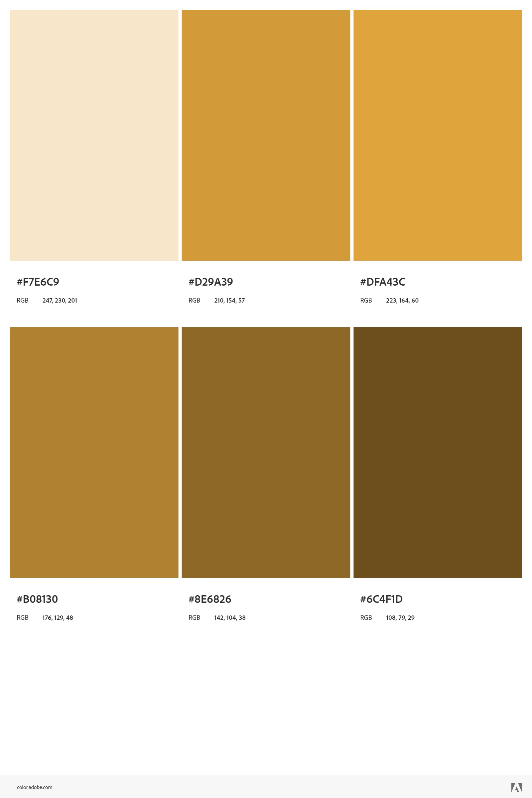

# Frontend - Little Paw
## Acerca del Proyecto 
Little Paw es una aplicación web que permite a los usuarios encontrar y adoptar mascotas, además de poder publicar mascotas en adopción y ver los diferentes refugios que existen con su propia información.

## Tecnologías Utilizadas
- React
- Material-UI
- Axios
- Tailwind CSS
- React Router

## Instalación
1. Clonar el repositorio
```bash
git clone https://github.com/Little-Paw-last-dance/frontend_littlepaw.git
```
2. Instalar las dependencias
```bash
npm install
```
3. Iniciar el servidor
```bash
npm start
```

## Estrucutra del Proyecto
```
frontend_littlepaw
├── public
└── src
    ├── assets
    ├── components
    ├── pages
    ├── config
    ├── contexts
    ├── helpers
    ├── models
    ├── themes
```
### src/assets
En esta carpeta se encuentran los archivos estáticos como imágenes, iconos, etc.

### src/components
En esta carpeta se encuentran los componentes de React que se utilizan en las diferentes páginas.

### src/pages
En esta carpeta se encuentran las páginas del proyecto, como las páginas de inicio, de adopción, de refugios, inicio de sesión y registro.

### src/config
En esta carpeta se encuentran los archivos de configuración tanto para crear la instancia de Axios para conectarse al backend y la configuración de Firebase.

### src/contexts
En esta carpeta se encuentra el contexto de autenticación para manejar el estado de la sesión del usuario.

### src/helpers
En esta carpeta se encuentra el archivo para manejar las rutas privadas.

### src/models
En esta carpeta se encuentran los modelos de datos que se utilizan en el proyecto para manejar la información de las mascotas, ciudades y los refugios.

### src/themes
En esta carpeta se encuentran los estilos globales del proyecto.

## Pantallas
### Bienvenida


La pantalla de bienvenida es la primera pantalla que se muestra al usuario, en esta pantalla se muestra dos botones, uno para iniciar sesión y otro para registrarse.

### Registro


La pantalla de registro es donde el usuario puede crear una cuenta en la página, se le solicita su nombre, apellido paterno, apellido materno, correo electrónico, contraseña y confirmación de contraseña, ciudad, numero de teléfono y código de país y la edad.


### Inicio de Sesión


La pantalla de inicio de sesión es donde el usuario puede ingresar a su cuenta, se le solicita su correo electrónico y contraseña.


### Pantalla Principal


La pantalla principal es donde se da la bienvenida al usuario, se muestran los filtros para buscar mascotas por su tipo, es decir, perros, gatos, conejos, etc. Además de poner la barra de busqueda para encontrar mascotas por alguna palabra clave. Finalmente se muestran las mascotas que se encuentran en adopción con su respectiva información reelevante, como su nombre, edad, sexo, raza y una foto.


### Sidebar


La sidebar es donde se muestra el menú de navegación, en el cual se puede acceder a las diferentes secciones de la página, como la página principal, la página de añadir mascotas, la página de refugios y la página de perfil.

### Añadir Mascota


La página de añadir mascota es donde el usuario puede publicar una mascota en adopción, se le solicita el nombre, edad, sexo, raza, tipo, descripción y tres fotos de la mascota.


### Refugios


La página de refugios es donde se muestran los diferentes refugios que existen, con su respectiva información, como su nombre, dirección, teléfono y una foto.

### Refugio


La página de refugio es donde se muestra la información de un refugio en específico, con su respectiva información, como su nombre, teléfono, página web y una foto. Además se muestra las mascotas que se encuentran en adopción en ese refugio.

### Información de Mascota


La página de información de mascota es donde se muestra la información de una mascota en específico, con su respectiva información, como su nombre, edad, sexo, raza, tipo, descripción y tres fotos, con la opción de poder adoptarla que redirige a WhatsApp para contactar al dueño de la mascota.

### Perfil


La página de perfil es donde se muestra la información del usuario, como su nombre, apellido paterno, apellido materno, ciudad, número de teléfono y edad. Además se tiene la opción de poder editar la información del usuario.

### Perfil Editable


La página de perfil editable es donde se muestra la información del usuario, como su nombre, apellido paterno, apellido materno, ciudad, número de teléfono y edad, pero con la opción de poder editar la información del usuario y guardar los cambios.

## Palete de Colores



## Fuentes

- [Montserrat](https://fonts.google.com/specimen/Montserrat)
- [Roboto](https://fonts.google.com/specimen/Roboto)

## LICENSE
<!DOCTYPE html>
<html lang="es">
<body>
    <p>
        <a href="https://github.com/Little-Paw-last-dance/frontend_littlepaw" target="_blank">Little-Paw-last-dance Frontend</a> © 2024 por Little Paw está licenciado bajo 
        <a href="https://creativecommons.org/licenses/by-nc-nd/4.0/" target="_blank" rel="license noopener noreferrer">
            Creative Commons Attribution-NonCommercial-NoDerivatives 4.0 International
            
            
            
            
        </a>
    </p>
</body>
</html>
